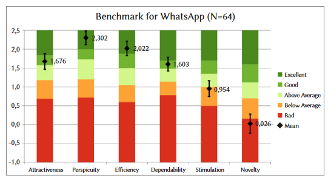
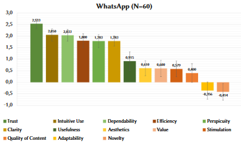

{align=right width="30%"}

*Kollmorgen, Jessica; Hinderks, Andreas; Thomaschewski, Jörg (2024): __Selecting the Appropriate User Experience Questionnaire and Guidance for Interpretation: the UEQ Family__. International Journal of Interactive Multimedia and Artificial Intelligence.* **||** [Download](https://www.ijimai.org/journal/sites/default/files/2024-08/ip2024_08_005.pdf)

### Zusammenfassung

Die UEQ-Familie bietet eine flexible Möglichkeit, die User Experience (UX) von Produkten zu messen. Mit den Varianten UEQ, UEQ-S und UEQ+ können unterschiedliche Anwendungsfälle abgedeckt werden. Ziel dieses Artikels ist es, die Vielfalt der verfügbaren Werkzeuge verständlich und zugänglich zu machen, inklusive der Nutzung von Benchmarks, Key Performance Indicators (KPI) und der Importance-Performance-Analyse (IPA).

Hier finden Sie den idealen Einstiegspunkt, um sich in den UEQ, UEQ+ oder UEQ-S einzuarbeiten und der Artikel gibt schon erfahrenen UEQ-Anwender:innen eine gute Übersicht über derzeitige UEQ-Literatur. 

<!-- more -->

### Fakten zur UEQ-Familie

**UEQ (User Experience Questionnaire)**

  - Misst sechs UX-Faktoren: Attraktivität, Durchschaubarkeit, Effizienz, Steuerbarkeit, Stimulation und Originalität.
  - Umfangreiches Werkzeug für detaillierte Analysen, übersetzt in mehr als 30 Sprachen.
  - Kostenlos mit Auswertetool unter [https://www.ueq-online.org/](https://www.ueq-online.org/)

**UEQ-S (Short)**

  - Kurzversion mit acht Items, von denen 4 Items die pragmatische und 4 Items die hedonische Qualität messen.
  - Es wurden die "am besten passenden" Items aus dem UEQ genommen. Daher ebenfalls in mehr als 30 Sprachen verfügbar.
  - Ideal für den schnellen Einsatz, z. B. nach einem Online-Kauf. 
  - Kostenlos mit Auswertetool unter [https://www.ueq-online.org/](https://www.ueq-online.org/) 

**UEQ+ (Modular)**

  - Modular aufgebaut, mit 27 UX-Faktoren wie Vertrauen, Visuelle Ästhetik und Inhaltsqualität.
  - Der eigentliche Fragebogen wird modular (mit 6-7 Faktoren) aus den 27 Faktoren aufgebaut und kann damit sehr gut an das zu messende PRodukt angepasst werden.
  - Perfekt für viele Produkte wie Medizingeräte oder Smart Devices. 
  - Kostenlos mit Auswertetool unter [https://ueqplus.ueq-research.org/](https://ueqplus.ueq-research.org/) 

Hier exemplarisch zwei Abblidungen aus dem Artikel.

{width="50%"}

*Abbildung 12: Benchmark-Darstellung der UX-Faktoren für WhatsApp mit dem UEQ.*

---

{width="50%"}

*Abbildung 17: Messung der empfundenen Wichgikeit von UX-Faktoren für WhatsApp mit dem UEQ+.*

---

### Die Geschichte zum Artikel
Die Messung des Nutzererlebnisses ist heute wichtiger denn je. Produkte sollen nicht nur funktionieren, sie müssen auch begeistern. Doch bei der Vielzahl an Studien und Artikeln zum User Experience Questionnaire (UEQ) fragen sich viele: Wo soll man anfangen? Seit seiner Einführung im Jahr 2006 hat sich der UEQ weiterentwickelt und ist zu einer vielseitigen Werkzeugfamilie gewachsen. Doch diese Vielfalt kann überwältigend wirken – selbst für Fachleute.

Genau hier setzt dieser Artikel an. Die Autoren möchten Orientierung geben und haben einen umfassenden Überblick über die UEQ-Familie geschaffen. Sie stellen nicht nur die klassischen Varianten vor, sondern erklären auch, welche Version für welche Fragestellung am besten geeignet ist.

Die UEQ-Familie wäre jedoch nur halb so nützlich, wenn es nicht praktische Hilfsmittel zur Auswertung gäbe, daher gibt es z jeder Version ein Excel-Tool zur Auswertung, mit denen Unternehmen die Ergebnisse nicht nur statistisch analysieren, sondern auch mit Benchmarks vergleichen können. So wird beispielsweise klar, ob ein Produkt im Vergleich zu über 240 anderen als exzellent oder verbesserungswürdig eingestuft wird.

Dieser Artikel ist mehr als eine Einführung in die UEQ-Familie. Er zeigt, wie man in einer Flut von Informationen den Überblick behält und die passenden Werkzeuge zur Hand hat, um Nutzerfeedback gezielt in Verbesserungen umzusetzen. Die Autoren haben es geschafft, ein komplexes Thema klar und praxisnah darzustellen – eine wertvolle Hilfe für alle, die das Nutzererlebnis wirklich verstehen wollen.
