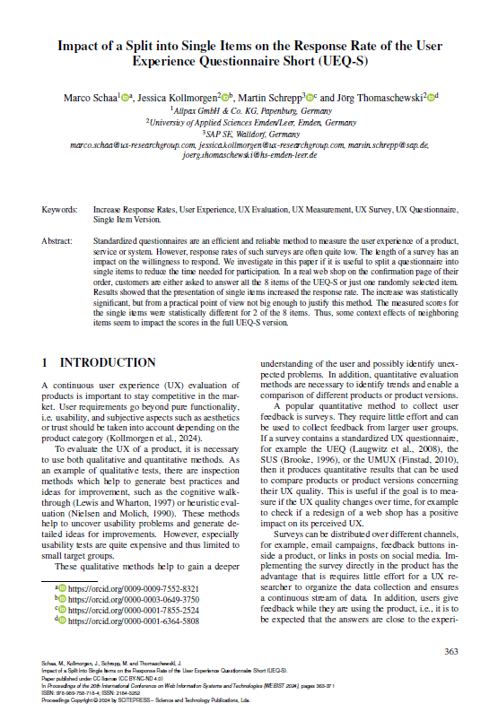

{align=right width="30%"}

*Schaa, Marco; Kollmorgen, Jessica; Schrepp, Martin; Thomaschewski, Jörg (2024):   __Impact of a Split into Single Items on the Response Rate of the User Experience Questionnaire Short (UEQ-S)__.* **||** 
<a href="https://www.scitepress.org/Papers/2024/130464/130464.pdf">Download</a>

### Zusammenfassung

**Hintergrund der Studie:** Diese Studie untersucht, wie das Aufteilen des UEQ-S in einzelne Items die Rücklaufquote erhöht und inwiefern dies die Ergebnisse verändert. Hierzu wurden die Items in einen deutschen Online-Shop integriert und das reale Verhalten von 1.387 Kundinnen und Kunden untersucht.

<!-- more -->

**Methodik:** Die Studie erfolgte anhand eines deutschen Online-Shop. Kundinnen und Kunden wurden nach dem Abschluss einer Bestellung entweder der vollständige UEQ-S (8 Items) oder ein zufällig ausgewähltes einzelnes Item aus dem UEQ-S präsentiert. Die Antworten von 1.387 Teilnehmenden wurden analysiert, um Unterschiede in Rücklaufquote und Ergebnissen zu bewerten.

**Ergebnisse:** Die Rücklaufquote stieg bei der Einzel-Item-Darstellung um durchschnittlich 1 %, zeigte jedoch keine praktisch bedeutsame Verbesserung. Die Ergebnisse der pragmatischen Items (z. B. „kompliziert/einfach“) waren konsistent zwischen den beiden Darstellungsformen. Unterschiede zeigten sich bei den hedonischen Items (z. B. „langweilig/aufregend“), deren Bewertungen in der Einzel-Item-Darstellung signifikant höher ausfielen. Dies könnte daran liegen, dass einzelne Items ohne den Kontext benachbarter Fragen von Teilnehmenden anders interpretiert werden bzw. mehr Aufmerksamkeit erhalten.

**Implikationen für die Praxis:** Das Aufteilen des UEQ-S in Einzel-Items ist bei kurzen Fragebögen wie dem UEQ-S nicht empfehlenswert, da der minimal höhere Rücklauf die Verluste an Datentiefe nicht rechtfertigt. Für spezifische Szenarien wie Umfragen auf kleinen Bildschirmen oder in sprachbasierten Systemen kann die Einzel-Item-Darstellung jedoch eine sinnvolle Alternative sein. Die Studie könnte auch so interpretiert werden, dass es oftmals nicht notwendig ist, nur ein einzelnes Item anzuzeigen wie etwa beim NPS. Wenn man stattdessen den UEQ-S oder einen vergleichbaren Fragebogen einsetzt, verringert sich die Bereitschaft zur Teilnahme vermutlich kaum, doch die Aussagekraft erhöht sich sehr.

**Fazit:** Die Studie zeigt, dass der UEQ-S in seiner vollständigen Form robust und effizient ist. Eine Anwendung von Einzel-Items sollte auf besondere Anwendungsfälle beschränkt bleiben.
