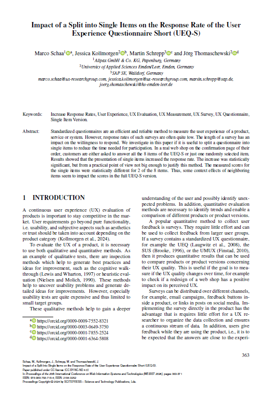

{align=right width="30%"}

*Schaa, Marco; Kollmorgen, Jessica; Schrepp, Martin; Thomaschewski, Jörg (2024):   __Impact of a Split into Single Items on the Response Rate of the User Experience Questionnaire Short (UEQ-S)__.* **||** 
<a href="https://www.scitepress.org/Papers/2024/130464/130464.pdf">Download</a>

## Zusammenfassung

Die Studie von Marco Schaa et al. (2024) untersucht, wie das Aufteilen des UEQ-S in einzelne Items die Rücklaufquote erhöht und inwiefern dies die Ergebnisse verändert. 

Hierzu wurden die Items in einen deutschen Online-Shop integriert und das reale Verhalten von 1.387 Kundinnen und Kunden untersucht. 

Das Ergebnis ist, dass die Einzel-Item-Version des UEQ-S die Rücklaufquote um ca. 1% leicht steigert und damit keine wirklichen Vorteile gegenüber der vollständigen Version bietet.  

<!-- more -->

### Fakten

**Studienziel** 

- Untersuchung der Auswirkungen der Einzel-Item-Darstellung auf Rücklaufquote und Ergebnisse.

**Methodik**

  - Vergleich der vollständigen UEQ-S-Version mit einer zufällig ausgewählten Einzel-Item-Version.
  - Jedem Kunden wurde auf der Abschlussseite nach einem erfolgreichen Kauf entweder der UEQ-S oder nur ein einzelnen, zufällig ausgewähltes Itempaar aus dem UEQ-S angezeigt.

**Ergebnisse**

  - 1.387 ausgefüllte Datensätze (413 UEQ-S Vollversion, 964 UEQ-S Einzelitems)
  - Rücklaufquote stieg bei Einzel-Item-Version um 1 %.
  - Pragmatic-Quality-Items zeigten ähnliche Ergebnisse in beiden Versionen.
  - Hedonic-Quality-Items wurden in der Einzel-Item-Version höher bewertet.

**Schlussfolgerung**

  - Einzel-Item-Darstellung erhöht Rücklaufquote nur minimal um ca. 1%.
  - Für kurze Fragebögen wie den UEQ-S wird die vollständige Version empfohlen.

---

### Die Geschichte zum Artikel

Stell dir vor, du bist der Inhaber eines mittelgroßen Online-Shops. Jeden Tag klickt sich eine Vielzahl von Kundinnen und Kunden durch deine Produkte – manche kaufen, andere nicht. Du möchtest wissen, wie zufrieden sie mit ihrem Einkaufserlebnis sind. Doch hier beginnt das Dilemma: Die meisten ignorieren deine Umfragen. Wenn man aber statt dem UEQ-S mit seinen 8 Itempaaren nun nur 1 Itempaar anzeigt, wie beim NPS, dann sollte sich die Teilnehmerzahl doch wohl deutlich erhöhen. Eine Frage schnell zu beantworten macht ja nun wirklich keine Mühe.

Genau dieser Frage widmete sich Marco Schaa et al. in ihrer Studie von 2024. Das Ziel: Herausfinden, ob ein Fragebogen, der in einzelne Fragen aufgeteilt ist, mehr und bessere Rückmeldungen bringt als die vollständige Version. Sie wollten wissen:
- Beeinflusst die Aufteilung in Einzel-Items die Rücklaufquote?
- Verändert diese Darstellungsweise die Ergebnisse im Vergleich zum vollständigen Fragebogen?

Um Antworten zu finden, setzten sie in einem echten deutschen Online-Shop ein cleveres Experiment auf. Hier wurden 14.469 Kundinnen und Kunden entweder mit der kompletten Kurzversion des User Experience Questionnaire (UEQ-S) oder nur mit einer zufällig ausgewählten Frage konfrontiert.

Und die Ergebnisse? Überraschend: Die Einzel-Item-Version erhöhte die Rücklaufquote leicht – um 1 %. Während Fragen zur pragmatischen Qualität in beiden Versionen ähnlich bewertet wurden, erhielten die Fragen zur hedonischen Qualität in der Einzel-Item-Version höhere Werte.

„Das war unerwartet,“ erklärt Marco Schaa, der Erstautor der Studie. „Wir hatten erwartet, dass die Aufteilung die Rücklaufquote stärker steigert. Stattdessen war der Anstieg zwar signifikant, aber nicht groß genug, um die Reduktion der Datentiefe zu rechtfertigen.“

Die Forscher zogen ein klares Fazit: Für kurze Fragebögen wie den UEQ-S lohnt sich die Aufteilung nicht.

Das bedeutet konkret: Wenn du bisher nur einzelne Fragen wie den Net Promoter Score (NPS) verwendet hast, solltest du darüber nachdenken, auf kurze, vollständige Fragebögen umzusteigen. Die Studie zeigt, dass eine umfassendere Befragung mehr Einblick in das Nutzererlebnis gibt, ohne die Rücklaufquote signifikant zu gefährden. Für sehr spezifische Anwendungsfälle, wie extrem begrenzte Bildschirmgrößen oder Sprachassistenten, könnten Einzel-Items jedoch weiterhin sinnvoll sein.

