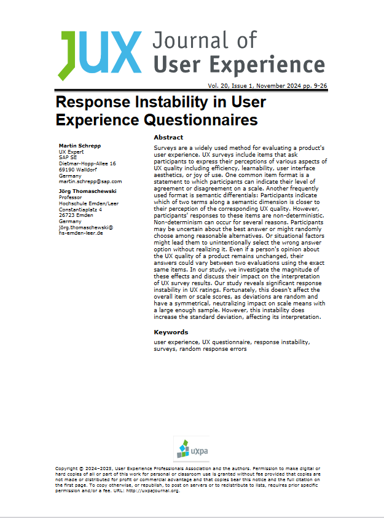

{align=right width="30%"}

*Schrepp, Martin; Thomaschewski, Jörg (2024): __Response Instability in User Experience Questionnaires__. Journal of User Experience.* **||** [Download](https://uxpajournal.org/wp-content/uploads/sites/7/2024/11/JUX_Schrepp_Nov-2024.pdf)

### Zusammenfassung

Die Autoren untersuchen, wie stabil die Ergebnisse von UX-Fragebögen sind, wenn dieselben Teilnehmer:innen den Fragebogen nach 14 Tagen erneut. Die Studie zeigt, dass die Skalenmittelwerte bei ausreichend großen Stichproben stabil bleiben, obwohl individuelle Antworten hohe Schwankungen aufweisen. Die Autoren geben konkrete Empfehlungen, wie diese Instabilität bei der Planung und Interpretation von UX-Studien berücksichtigt werden kann.

<!-- more -->

### Fakten

**Studienziel**  

  - Wir wollten wissen, wie stabil die Ergebnisse von UX-Fragebögen sind, wenn dieselben Teilnehmer:innen den Fragebogen nach 14 Tagen erneut ausfüllen.

**Methodik**  

  - 67 Teilnehmer, die jeweils zwei Produkte bewerteten und nach ca. 14 Tagen diese Produkte erneut bewerteten 
  - Verwendete Fragebögen: User Experience Questionnaire Short (UEQ-S), UMUX, VISAWI-S, NPS  
  - Fragebögen so ausgewählt, das unterschiedliche Skalenformate vorhanden sind.
  - Gemessene Produkte: Instagram, Netflix, Spotify, Moodle, Amazon Produktsuche und Microsoft Teams. 
  - Produkte sollten gut bekannt sein und den privaten Bereich und beruflichen Bereich abdecken.

**Ergebnisse**

  - Die Mittelwerte der UX-Messungen sind robust und ändern sich bei wiederholter Messung nicht signifikant, selbst wenn wie hier die Stichprobegöße nur 14 - 26 Teilnehmende je Produkt beträgt.
  - Um wirklich stabile UX-Messungen zu erhalten, sollten deutlich mehr Teilnehmende befragt werden.  
  - Einzelantworten wichen um bis zu ±1 Punkt auf einer 7-Punkte-Likert-Skala ab.
  - Standardabweichungen stiegen durch Instabilität um bis zu 25 %.

**Schlussfolgerung**

  - Erhöhte Standardabweichungen nicht als Zeichen für Meinungsvielfalt deuten, sondern als mögliche Folge von Instabilität.
  - Die Mittelwerte der UX-Messungen sind robust, wenn genügend Probanden befragt werden. 
  - *Anmerkung zum Artikel von Jörg Thomaschewski:* Als Erfahrungswert würde ich mehr als 30 Probanden empfehlen, auch wenn dies so nicht im wissenschaftlichen Artikel steht, weil wir es ja nicht nachgewiesen haben. Bei mehr als 50 Probanden sollte man in fast allen Fällen auf der sicheren Seite sein. 

## Die Geschichte hinter der Studie
Es begann mit einer einfachen Frage: Wie stabil sind die Ergebnisse, wenn man eine UX-Studie wiederholt? Die Autoren wollten genau das herausfinden. Sie starteten ein Experiment mit 67 Teilnehmern, die insgesamt 132 Bewertungen abgaben, indem sie Produkte aus zwei Kategorien mit unterschiedlichen UX-Fragebögen bewerteten: Unterhaltung (Instagram, Netflix, Spotify) und zielorientierte Anwendungen (Moodle, Amazon Produktsuche und Microsoft Teams). Die Teilnehmer füllten die gleichen UX-Fragebögen zweimal aus – einmal heute und erneut etwa zwei Wochen später.

Der zeitliche Abstand von durchschnittlich 15 Tagen war sorgfältig gewählt. Einerseits sollte verhindert werden, dass sich die Teilnehmer an ihre vorherigen Antworten erinnerten, und andererseits sollte die Meinung zu den Produkten in dieser kurzen Zeit stabil bleiben. Zur Kontrolle wurden die Teilnehmer am Ende gefragt, ob sich ihre Meinung zu einem Produkt grundlegend geändert habe – nur in wenigen Fällen war das der Fall, und diese Daten wurden ausgeschlossen.

**Überraschende Erkenntnisse:** Die ersten Ergebnisse waren verblüffend. Die Mittelwerte der UX-Skalen blieben weitgehend stabil, was ein gutes Zeichen für die Aussagekraft der UX-Fragebögen ist. Doch der Teufel steckte im Detail: Einzelne Antworten wichen teils deutlich ab. Auf einer 7-Punkte-Likert-Skala war es nicht ungewöhnlich, dass die Bewertungen eines Teilnehmers um bis zu ±1 Punkt variierten. Es schien, als hätten die Teilnehmer ihre Meinung geändert – obwohl sie es vielleicht gar nicht bewusst getan hatten. Warum passierte das?

**Die Ursache:** Die Antwortinstabilität war ein zentrales Thema der Studie. Sie zeigte, dass Schwankungen in den Antworten oft nicht auf tatsächliche Meinungsänderungen zurückzuführen sind, sondern auf zufällige Einflüsse wie Ablenkung, unterschiedliche Erinnerungen oder schlicht auf den Prozess des Entscheidens selbst. Diese Instabilität ist aber kein Problem für die Mittelwerte der Skalen, da sie symmetrisch und zufällig verteilt war. Sie beeinflusste jedoch die Standardabweichungen, was UX-Praktiker bei der Interpretation der Ergebnisse beachten müssen.

**Unsere Tipps als Ergebnis der Studie:** Große Stichproben sind entscheidend, um stabile Mittelwerte zu gewährleisten und 
Standardabweichungen sollten mit Vorsicht interpretiert werden, da sie oft nicht nur die Meinungsvielfalt widerspiegeln, sondern auch die Instabilität der Antworten.