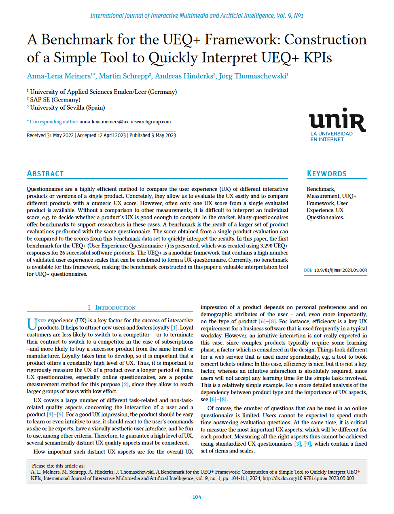

{align=right width="30%"}

### Quellenangabe
*Meiners, Anna-Lena; Schrepp, Martin; Hinderks, Andreas; Thomaschewski, Jörg (2024): __A Benchmark for the UEQ+ Framework: Construction of a Simple Tool to Quickly Interpret UEQ+ KPIs__. In: IJIMAI (International Journal of Interactive Multimedia and Artificial Intelligence) 9 (1), S. 104–111. DOI: 10.9781/ijimai.2023.05.003.* **||** [Download](https://www.ijimai.org/journal/sites/default/files/2024-11/ijimai_9_1_10.pdf)

### Zusammenfassung

**Hintergrund der Studie:** Der Einsatz von Fragebögen ist ein effektives Mittel, um die User Experience (UX) verschiedener Produkte quantitativ zu vergleichen. Der UEQ+ als erweiterbares Framework für UX-Fragebögen stand bisher ohne einen Vergleichsmaßstab da, was die Interpretation von Einzelergebnissen erschwerte.

<!-- more -->

**Methodik:** Zur Entwicklung des ersten UEQ+ Benchmarks wurden Antworten von 3.290 Teilnehmenden aus Bewertungen von 26 Softwareprodukten herangezogen. Ziel war es, einen Maßstab zu schaffen, der Einzelergebnisse schnell und präzise einordnen lässt.

**Ergebnisse:** Mit einem Spektrum von KPI-Werten, die von +0,39 (Facebook) bis +1,82 (Google Maps) reichen, bietet der neue Benchmark eine klare Orientierung für die Bewertung der UX-Qualität. Er ermöglicht einen direkten Vergleich zwischen Produkten und erleichtert die Einordnung der UX eines Produktes im Verhältnis zu etablierten Marktführern.

**Implikationen für die Praxis:** Dieser Benchmark ist ein unverzichtbares Instrument für UX-Forschende und Praktiker. Er erlaubt eine schnelle Interpretation von UEQ+ Ergebnissen, indem er eine fundierte Vergleichsbasis zu einer breiten Palette erfolgreicher Softwareprodukte bietet. Damit unterstützt er eine gezielte UX-Optimierung auf der Grundlage valider Daten.
