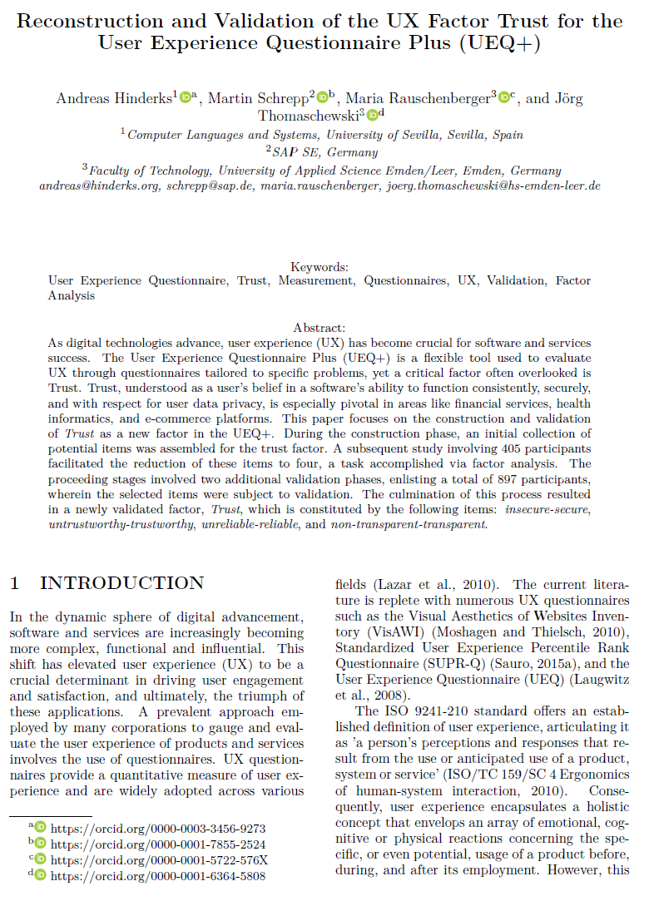

{align=right width="30%"}

### Quellenangabe
*Hinderks, Andreas; Schrepp, Martin; Rauschenberger, Maria; Thomaschewski, Jörg (2023): __Reconstruction and Validation of the UX Factor Trust for the User Experience Questionnaire Plus (UEQ+)__. In: Proceedings of the 19th International Conference on Web Information Systems and Technologies (WEBIST 2023)* **||** [Download](https://www.scitepress.org/Papers/2023/121867/121867.pdf)

### Zusammenfassung

**Hintergrund der Studie:** Der Artikel zielt darauf ab, den UX-Faktor Vertrauen innerhalb des Kontextes der User Experience messbar zu machen. Die Autoren argumentieren, dass Vertrauen in die Software, verstanden als Zuversicht in die konsistente Funktionsweise, Sicherheit und Datenschutz, ein wesentlicher, jedoch bisher vernachlässigter Aspekt der Nutzererfahrung (= User Experience) ist.

<!-- more -->

**Methodik:** Um den Faktor Vertrauen im UEQ+ zu integrieren, wurde zunächst eine Sammlung von 9 potenzieller Item-Paare generiert. Mittels einer explorativen Faktorenanalyse mit 405 Teilnehmenden aus verschiedenen Ländern wurden diese Item-Paare auf diejenigen reduziert, die statistisch belastbar das Konstrukt Vertrauen abbilden. 

**Ergebnisse:** Die vier finalen Items-Paare sind: ***insecure-secure, untrustworthy-trustworthy, unreliable-reliable, non-transparent-transparent*** bzw. übersetzt ***unsicher-sicher, unseriös-seriös, unzuverlässig-zuverlässig, intransparent-transparent***. Die Reduzierung auf vier Items erfolgte mit dem Ziel, ein prägnantes und robustes Maß für Vertrauen zu schaffen. Diese Items wurden in zwei weiteren Validierungsstudien mit insgesamt 897 Teilnehmenden geprüft. Die Validierung bestätigte, dass die ausgewählten Items konsistente und zuverlässige Messungen des Faktors Vertrauen (Trust) ermöglichen.

**Implikationen für die Praxis:** Die Integration des UX-Faktors Vertrauen in den UEQ+ bietet nun die Möglichkeit, diesen Faktor systematisch zu erfassen und zu bewerten. Dies ist besonders relevant für Anwendungen, bei denen Vertrauen eine zentrale Rolle spielt, wie bei Finanzdienstleistungen, Gesundheitsanwendungen und E-Commerce-Plattformen.

Die Studie trägt wesentlich dazu bei, das Verständnis für die Rolle des Faktors Vertrauen in der UX zu vertiefen und bietet eine Grundlage für die Weiterentwicklung von Werkzeugen zur UX-Bewertung.

