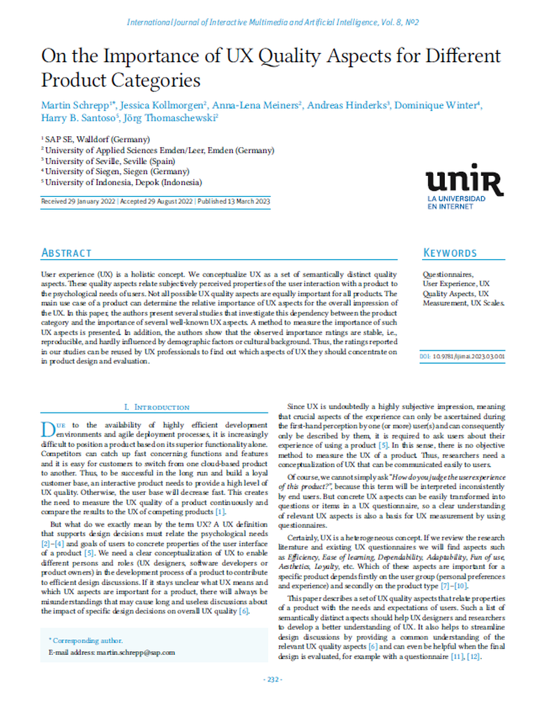

{align=right width="30%"}

### Quellenangabe
*Schrepp, Martin; Kollmorgen, Jessica; Meiners, Anna-Lena; Hinderks, Andreas; Winter, Dominique; Santoso, Harry B.; Thomaschewski, Jörg (2023): __On the Importance of UX Quality Aspects for Different Product Categories__. In: International Journal of Interactive Multimedia and Artificial Intelligence, Vol. 8, No. 2* **||** [Download](https://reunir.unir.net/bitstream/handle/123456789/14368/ijimai8_2_22.pdf)

### Zusammenfassung

**Hintergrund der Studie:** Der Artikel ist ein Standardwerk, wenn es um die Fragestellung geht, welche UX Aspekte für welche Produkte oder Produktkategorien gemessen werden sollten.  

<!-- more -->

**Methodik:** Untersucht wird die Abhängigkeit zwischen der Produktkategorie und der Wichtigkeit verschiedener bekannter UX-Qualitätsaspekte. Es wird eine Methode vorgestellt, um die Wichtigkeit solcher UX-Aspekte zu messen. Zudem zeigen die Autoren, dass die beobachteten Wichtigkeitsbewertungen stabil und kaum von demografischen Faktoren oder kulturellem Hintergrund beeinflusst sind.

**Ergebnisse:** Die Studie präsentiert Ergebnisse aus 5 unabhängigen Studien mit insgesamt 361 Probanden, die fast 70000 Bewertungen zu der Wichtigkeit beschriebener UX-Qualitätsaspekte für unterschiedliche Produktkategorien abgaben. Diese Ergebnisse bieten UX-Praktikern und Forschern Orientierungshilfe darüber, auf welche Aspekte des Designs sie sich während der Entwurfsphase neuer Produkte und bei der Bewertung interaktiver Produkte konzentrieren könnten.

**Implikationen für die Praxis:** Die Ergebnisse tragen dazu bei, das Verständnis der Rolle verschiedener UX-Qualitätsaspekte zu vertiefen und bieten eine Grundlage für die Weiterentwicklung von Werkzeugen zur UX-Bewertung. Insbesondere die Kenntnis darüber, welche UX-Aspekte für bestimmte Produktkategorien als wichtig erachtet werden, ist für die Gestaltung und Bewertung von Produkten von zentraler Bedeutung.