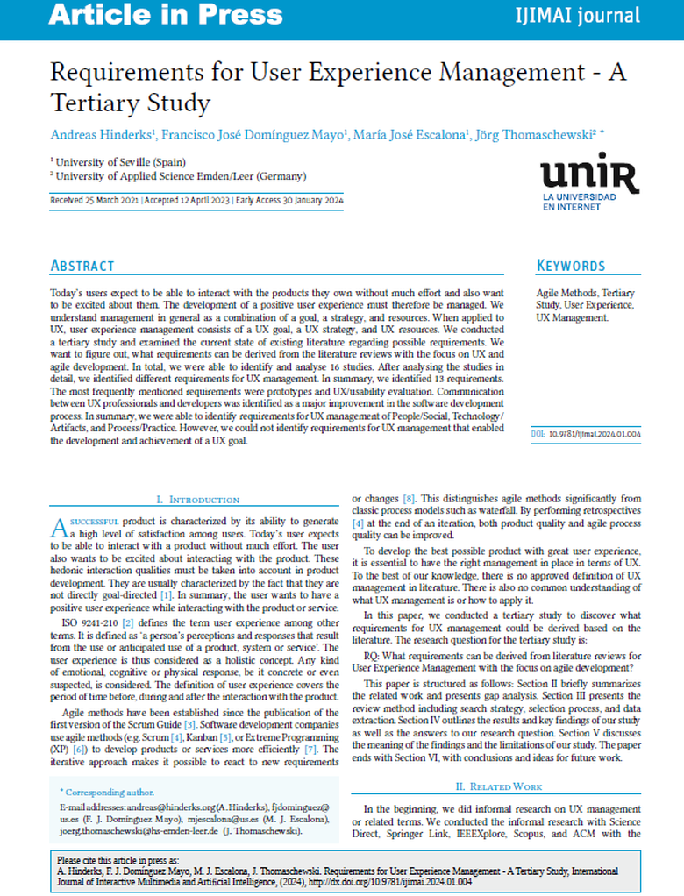

{align=right width="30%"}

### Quellenangabe
*Hinderks, Andreas; Domínguez Mayo, Francisco José; Escalona, María José; Thomaschewski, Jörg (2024): **Requirements for User Experience Management - A Tertiary Study**. In: IJIMAI (International Journal of Interactive Multimedia and Artificial Intelligence) 8 (6), S. 160–167. DOI: 10.9781/ijimai.2024.01.004.* **||** [Download](https://reunir.unir.net/bitstream/handle/123456789/16005/Requirements%20for%20User%20Experience%20Management.pdf)

### Zusammenfassung

**Hintergrund der Studie:** Das UX-Management erfordert klar definierte Ziele, Strategien und Ressourcen. Diese Studie widmet sich der Ermittlung von Anforderungen an das UX-Management im Kontext agiler Entwicklung durch eine Untersuchung der vorhandenen Literatur.

<!-- more -->

**Methodik:** In einer sehr ausführlichen, wissenschaftlichen Literaturstudie wurden insgesamt 16 Studien identifiziert und analysiert. Die Untersuchung beleuchtete verschiedene Anforderungen an das UX-Management.

**Ergebnisse:** Es wurden 13 spezifische Anforderungen identifiziert. Die am häufigsten genannten Anforderungen waren die Entwicklung von Prototypen und die Durchführung von UX/Usability-Evaluationen. Die Kommunikation zwischen UX-Profis und Entwickler*innen wurde als wesentlicher Faktor für die Verbesserung des Softwareentwicklungsprozesses genannt. Die Anforderungen konnten in die Kategorien Personen/Soziales, Technologie/Artefakte und Prozess/Praxis eingeteilt werden.

**Implikationen für die Praxis:** Die Identifikation klarer Anforderungen für das UX-Management im agilen Kontext ermöglicht es, gezielte Maßnahmen zur Verbesserung der User Experience zu ergreifen. Wichtig hierfür ist die (gedankliche) Einteilung in ***Personen/Soziales***, ***Technologie/Artefakte*** und ***Prozess/Praxis***. Für alle identifizierten Problemfelder und die 13 Anforderungen kann nun auf die passende Originalliteratur zugegriffen werden. Die Studie unterstreicht außerdem die Bedeutung der ***Integration von UX-Zielen, -Strategien und -Ressourcen in den agilen Entwicklungsprozess*** und bietet praktische Ansätze für die Umsetzung eines effektiven UX-Managements.
