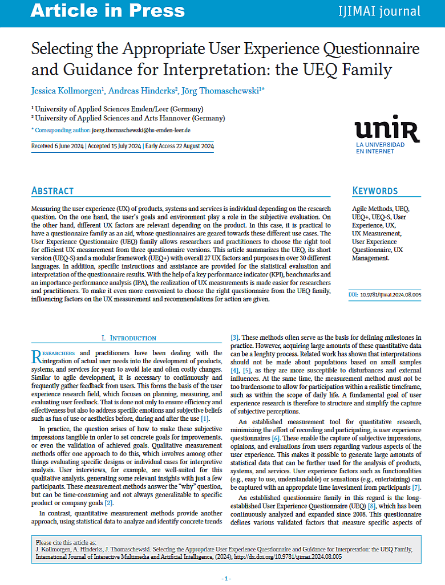

{align=right width="30%"}

### Quellenangabe
*Kollmorgen, Jessica; Hinderks, Andreas; Thomaschewski, Jörg (2024): __Selecting the Appropriate User Experience Questionnaire and Guidance for Interpretation: the UEQ Family__. International Journal of Interactive Multimedia and Artificial Intelligence.* **||** [Download](https://www.ijimai.org/journal/sites/default/files/2024-08/ip2024_08_005.pdf)

### Zusammenfassung

**Hintergrund des Artikels:** Dieser Artikel wurde erstellt, um eine Anleitung zur Auswahl und Interpretation der Fragebögen der User Experience Questionnaire (UEQ)-Familie zu bieten. Da es inzwischen viele Artikel zu UEQ, UEQ-S und UEQ+ (genannt UEQ-Familie) gibt, soll hier eine gute Übersicht über die wichtigen Artikel bis zum Jahr 2024 geschaffen werden. Zudem werden praktische Tipps zur statistischen Auswertung und zur Interpretation der Ergebnisse gegeben, inklusive der Nutzung von Benchmarks, Key Performance Indicators (KPI) und der Importance-Performance-Analyse (IPA).

Der Artikel ist der ideale Einstiegspunkt, wenn man sich in den UEQ einarbeiten möchte und gibt schon erfahrenen UEQ-Anwender:innen eine gute Übersicht über die wichtige UEQ-Literatur. 

<!-- more -->

**Methodik:** Der Artikel fasst die  wichtigen Artikel der UEQ-Familie zusammen, enthält aber selbst keine neuen Studien. 

**Implikationen für die Praxis:** UX-Resercher erhalten klare Empfehlungen zur Auswahl des geeigneten Fragebogens aus der UEQ-Familie je nach spezifischem Bedarf. Der Artikel bietet zudem detaillierte Anleitungen zur Interpretation der Ergebnisse, um fundierte Entscheidungen basierend auf den erhobenen Daten zu treffen.
