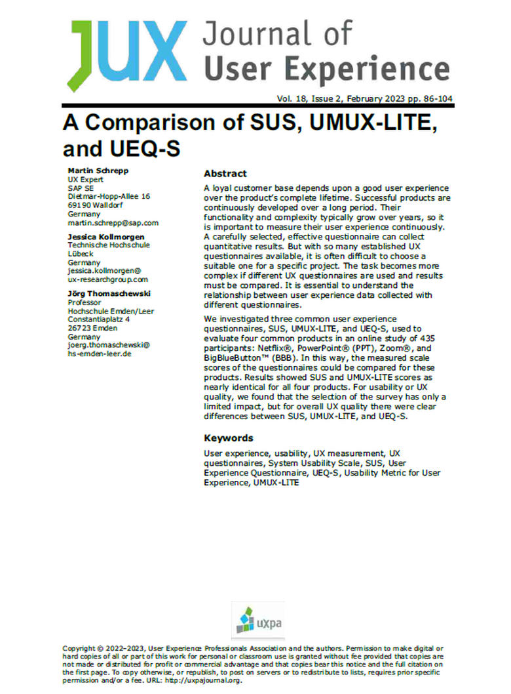

{align=right width="30%"}

### Quellenangabe
*Schrepp, Martin; Kollmorgen, Jessica; Thomaschewski, Jörg (2023): __A Comparison of SUS, UMUX-LITE, and UEQ-S__. In: Journal of User Experience, Vol. 18, Issue 2, February 2023, pp. 86-104* **||** [Download](https://uxpajournal.org/sus-umux-lite-ueq-s/)

### Zusammenfassung

**Hintergrund der Studie:** Verschiedene UX-Fragebögen messen verschiedene UX-Aspekte. Hier werden die Fragebögen SUS, UMUX-LITE und UEQ-S miteinander verglichen und zwar in Studien mit 435 Probanden für die vier bekannten Produkte Netflix®, PowerPoint® (PPT), Zoom®, BigBlueButton™ (BBB).

<!-- more -->

**Methodik:**  Die Studie untersuchte die Beziehungen zwischen den Daten zur UX, die mit drei verschiedenen Fragebögen (SUS, UMUX-LITE und UEQ-S) gesammelt wurden, durch deren Anwendung auf vier weit verbreitete Produkte (Netflix®, PowerPoint® (PPT), Zoom®, BigBlueButton™ (BBB)). Dabei wurden insgesamt 435 Teilnehmende in einer Online-Umfrage befragt. Jeder Fragebogen wurde dahingehend analysiert, wie gut er die UX der jeweiligen Produkte abbildet, und es wurde verglichen, inwiefern die Ergebnisse der verschiedenen Fragebögen übereinstimmen oder divergieren. Der Fokus lag dabei auf der Ermittlung der Skalenwerte und der Vergleichbarkeit der Ergebnisse zwischen den Fragebögen. Zusätzlich wurden demografische Daten und Nutzungshäufigkeiten der Teilnehmenden erhoben, um deren Einfluss auf die Bewertungen zu untersuchen. Diese methodische Herangehensweise ermöglichte eine tiefgreifende Analyse der Fragebögen hinsichtlich ihrer Anwendbarkeit und Aussagekraft für die Bewertung der Nutzererfahrung verschiedener Produktkategorien.

**Ergebnisse:** Die Studie ergab, dass die Werte von SUS und UMUX-LITE für Netflix®, PowerPoint® (PPT), Zoom® und BigBlueButton™ (BBB) bezüglich der Usability sehr ähnlich sind. Der UEQ-S hingegen zeigte abweichende Ergebnisse, da er auch die Hedonische Qualität misst. Betrachtet man die Werte der Pragmatischen Qualität des UEQ-S, so sind diese Wertee vergleichbar mit den Ergebnissen der Fragebögen SUS und UMUX-LITE. Fazit: die vier Items des UEQ-S zur pragmatischen Qualität stimmen gut mit den Ergebnissen von SUS und UMUX-LITE überein. Zusätzlich hat der UEQ-S aber noch vier Items für die Hedonische Qualität und ist für eine UX-Messung besser geeignet.

**Implikationen für die Praxis:** Die Auswahl des richtigen Fragebogens ist entscheidend für die präzise Erfassung und Bewertung der User Experience eines Produktes. Die Ergebnisse dieser Studie zeigen, dass SUS und UMUX-LITE vorrangig die Usability bewerten und dabei zu ähnlichen Ergebnissen kommen. Praktiker sollten den UEQ-S unbedingt in Betracht ziehen, wenn neben der Usability auch hedonische Aspekte, wie  ***langweilig-spannend***, ***uninteressant-interessant***, ***konventionell-originell*** und ***herkömmlich-neuartig*** von Interesse sind. 
