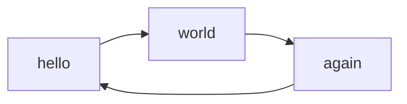

[TOC]

# Header 1

## Header 2

 

## Lehrmaterial
Das System ist so einfach, dass hier zukünftig viele Lehrangebote integriert werden.
Themen

* Essentials in Linux. 
> Die absoluten Grundlagen in Linux werden erst im Sommer 2024 hier online gehen. 
* Essentials in HTML, CSS und JavaScript. 
> Hier geht es wirklich um das minimale Wissen in diesen Bereichen.
* Essentials in Linux. 
* In der Praxis bewährte UX-Methoden 
* Mensch-Computer-Interaktion
> Was ist Usability, ...
* User Experience
> Was ist der Unterschied...
* Internet-Programmierung in PHP und Python 

Für all diese umfangreichen Themen wird es eine eigene Subdomain geben, unter der die Inhalte abgerufen werden können, also beispielsweise frontend.thomaschewski.de 

:smile:

!!! example "Beispiel"
    Dies ist ein Test einer Note

